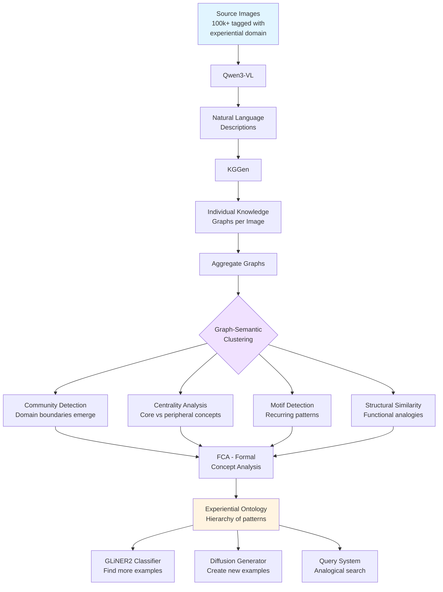
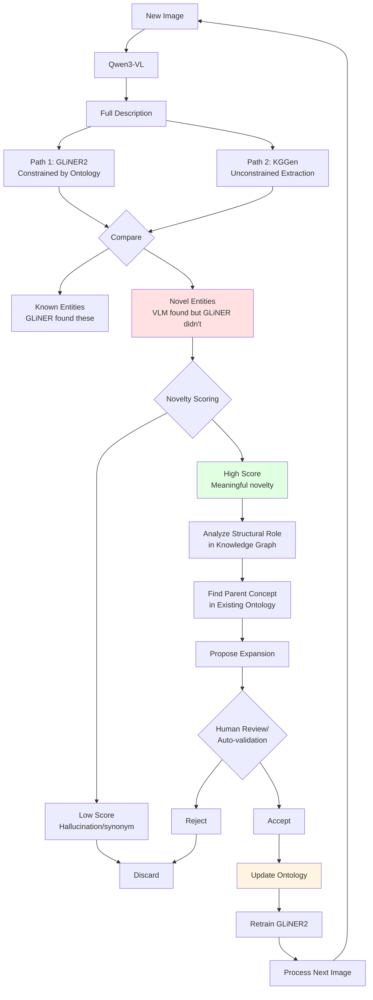

# Experiential Ontologies: Graph-Semantic Reasoning at Scale

**Date**: 2025-12-29
**Status**: Speculative Architecture
**Authors**: spacegoatai, Claude (Ol' Noggin Division)

## Core Insight

Traditional computer vision clusters by **similarity** (what things look like, what category they belong to). This approach uses graph-semantic reasoning to find **analogies** (what structural role things play, what relational patterns they exhibit).

**Key distinction**:
- **Similars**: car ~ truck ~ SUV (same domain, same features)
- **Analogies**: car:wheels :: dog:legs :: building:columns (same structure, different domains)

This enables **experiential domains** - not "images of cars" but "images with the feeling of walking to the bakery in the morning."

## The Vision

### From Objects to Experiences

**Traditional domain**:
```
Domain = "Cars"
→ All images containing vehicles
→ Ontology about car parts, colors, models
```

**Experiential domain**:
```
Domain = "When I walk to the bakery in the morning"
→ 100,000+ images tagged with this experience
→ Could include:
  - Sunrise lighting through trees
  - Cobblestone sidewalks with long shadows
  - Empty streets with quiet atmosphere
  - Steam rising from coffee cups
  - Bakery storefronts with warm light
  - Morning dew on leaves
  - Street lamps turning off
  - Croissants in windows
```

The ontology captures the **phenomenology** of the experience:
- Temporal patterns (lighting transitions, activity shifts)
- Atmospheric qualities (temperature, sound, visual qualities)
- Spatial movement (pedestrian routes, destinations)
- Sensory elements (aromas, textures, ambient sounds)

## Core Pipeline



### Graph-Semantic Clustering Details

Unlike embedding-based clustering (CLIP, sentence-transformers), graph-semantic clustering groups by **relational structure**:

**Community Detection**:
```python
# Groups emerge from graph connectivity, not semantic similarity
communities = louvain_clustering(aggregated_kg)
# Result: Natural domain boundaries discovered from structure
```

**Centrality-Based**:
```python
# Most important concepts by graph metrics
core_concepts = pagerank(aggregated_kg, top_k=100)
# Result: Core vs peripheral concept ontologies
```

**Motif-Based**:
```python
# Find recurring structural patterns
triangles = find_triangular_motifs(aggregated_kg)
# Result: Conceptually rich relational patterns
```

**Functional Similarity**:
```python
# Group by same predicates/structural role
compositional = find_entities_with_pattern(
    aggregated_kg,
    pattern="has_part(X, Y) where count(Y) > 5"
)
# Result: car, dog, building all cluster (compositional entities)
```

## Reverse-GLiNER2: Iterative Ontology Growth



### Novelty Scoring Algorithm

```python
def score_novelty(entity, graph, ontology, history):
    """
    Score how novel this entity is (0-1)
    """
    # 1. Semantic distance from existing ontology
    semantic_dist = min_distance_to_ontology(entity, ontology)
    # High distance = more novel

    # 2. Structural novelty (new relational patterns)
    entity_relations = graph.get_relations(entity)
    novel_patterns = count_unseen_patterns(entity_relations, ontology)
    # More unique patterns = more novel

    # 3. Consistency across images
    frequency = count_occurrences(entity, history)
    # Appears multiple times = less likely to be hallucination

    # 4. Graph centrality in current image
    importance = pagerank_score(entity, graph)
    # Higher importance = more likely to be meaningful

    return weighted_score(
        semantic_dist * 0.3,
        novel_patterns * 0.4,
        frequency * 0.2,
        importance * 0.1
    )
```

## Graph-Semantic vs CLIP Embeddings

### What Each Captures

| Dimension | CLIP Embeddings | Graph-Semantic Clustering |
|-----------|-----------------|---------------------------|
| **Input** | Raw pixels + text captions | Knowledge graph structure |
| **Similarity basis** | Visual + categorical | Structural + relational |
| **Training** | 400M image-text pairs | Relational patterns in data |
| **Explainability** | Black box (512D vector) | Fully explainable (graph paths) |
| **Cross-domain** | Same visual domain | Different domains, same function |
| **Reasoning** | No explicit reasoning | Explicit relational reasoning |
| **Granularity** | Holistic scene | Entity-level + relations |

### Example Comparison

**CLIP clustering** (appearance-based):
```
Cluster A: Vehicles (Celica, F-150, bike)
Cluster B: People scenes (college, performers)
Cluster C: Architecture (Parthenon, buildings)
```

**Graph-semantic clustering** (role-based):
```
Cluster A: Compositional entities
  - Celica (engine, wheels, doors, panels)
  - Dog (ears, fur, collar, features)
  - Parthenon (columns, steps, carvings)
  → Same function: multi-part wholes

Cluster B: Weathered/aged entities
  - Celica (corrosion, rust, decay)
  - Parthenon (weathered marble, aged)
  - Old signs (frayed edges, faded)
  → Same function: time-affected objects

Cluster C: Text-bearing entities
  - EXIT sign (has_text: "EXIT")
  - MOVING SALE sign (has_text: date)
  - F-150 badge (has_text: model)
  → Same function: information display
```

**Key insight**: CLIP says "Celica and F-150 are similar" (both vehicles). Graph-semantic says "Celica and Parthenon are similar" (both compositional + weathered).

### Hybrid Approach

Best results come from combining both:

```python
# Method 1: Visual clustering, then structural refinement
visual_clusters = kmeans(clip_embeddings, k=5)
# → [vehicles, people, architecture, nature, objects]

for cluster in visual_clusters:
    subgraph = extract_subgraph(aggregated_kg, cluster.images)
    structural_subclusters = graph_semantic_cluster(subgraph)
    # → vehicles: [modern, vintage, damaged]

# Method 2: Structural clustering, then visual refinement
functional_clusters = graph_semantic_cluster(aggregated_kg)
# → [compositional, spatial, aesthetic, temporal]

for cluster in functional_clusters:
    cluster_images = get_images_for_cluster(cluster)
    visual_subclusters = kmeans(clip.encode(cluster_images), k=3)
    # → compositional: [vehicles, animals, architecture]
```

## Diffusion with Ontology Constraints

Generate images that match ontological structure:

```python
def generate_from_ontology(ontology, diffusion_model, constraints):
    """
    Generate images fitting the experiential ontology
    """
    # Extract required entities/relations
    must_include = ontology.get_core_concepts()
    should_include = ontology.get_supporting_concepts()
    must_exclude = ontology.get_anti_concepts()

    # Build prompt from graph structure
    prompt = construct_prompt(
        core=must_include,
        supporting=should_include,
        mood=constraints.get('mood'),
        time=constraints.get('time'),
        location=constraints.get('location')
    )

    negative_prompt = ", ".join(must_exclude)

    # Generate
    image = diffusion_model.generate(
        prompt=prompt,
        negative_prompt=negative_prompt
    )

    # Verify ontology fit
    generated_kg = vlm_to_kg(image)
    fit_score = ontology_fit(generated_kg, ontology)

    if fit_score < threshold:
        # Regenerate with stronger guidance
        return generate_from_ontology(
            ontology,
            diffusion_model,
            constraints + stronger_constraints
        )

    return image, fit_score
```

### Diffused Ontologies (Ontology Interpolation)

Create blended experiences by interpolating ontologies:

```python
# Two experiential ontologies
morning_bakery = build_ontology_from_images("morning bakery walk")
afternoon_cafe = build_ontology_from_images("afternoon cafe")

# Interpolate between experiences
lunch_blend = interpolate_ontologies(
    morning_bakery,
    afternoon_cafe,
    weights={'morning': 0.3, 'afternoon': 0.7}
)

# Generate images matching blended experience
image = generate_from_ontology(lunch_blend, flux_model)
# → Image that feels like "late morning transitioning to lunch"
```

## Large-Scale Applications

### 1. Medical Imaging & Cross-Modality Diagnosis

**Scale**: 3 billion medical images created annually worldwide

**Approach**:
```
100M+ medical images (X-rays, CT, MRI, pathology)
         ↓
    Medical VLM descriptions
         ↓
    KGGen → Pathology graphs
         ↓
    Graph-semantic clustering finds structural analogies
         ↓
"This MRI liver pattern is analogous to known CT lung pattern"
```

**Impact**:
- Find diagnostic analogies across imaging modalities
- Discover rare disease similarities
- Predict treatment response from structural patterns
- Generate synthetic medical training data

### 2. Scientific Discovery Engine

**Scale**: 3M+ scientific papers published annually

**Approach**:
```
100M+ papers + figures + data visualizations
         ↓
    Extract graphs from text/figures
         ↓
    Find structural patterns across fields
         ↓
"Phase transition" pattern found in:
  - Physics: solid → liquid → gas
  - Biology: caterpillar → chrysalis → butterfly
  - Chemistry: reactant → intermediate → product
  - Social: stable → crisis → equilibrium
```

**Impact**:
- Accelerate discovery via cross-domain analogies
- Auto-suggest relevant papers from other fields
- Detect truly novel vs incremental research
- Materials discovery via natural analogues

### 3. Autonomous Systems (Experiential Navigation)

**Scale**: Billions of autonomous vehicle miles

**Approach**:
```
Billions of driving hours (dashcam)
         ↓
    VLM situation descriptions
         ↓
    KGGen → Situation graphs
         ↓
NOT: "Detect pedestrian, car, traffic light"
BUT: "Recognize experiential patterns"
  - "School zone at dismissal time" experience
  - "Parking lot exit on rainy day" experience
  - "Rural road at dusk with wildlife" experience
```

**Impact**:
- Better generalization to unseen scenarios
- Analogical transfer ("This is LIKE school dismissal but at construction site")
- Explainable decisions
- Generate edge-case training scenarios

### 4. Content Recommendation (Vibe-Based Search)

**Scale**: Trillions of images, $4 trillion e-commerce market

**Approach**:
```
User query: "I want to feel like a cozy rainy afternoon"

Traditional: Tags: rain, indoor, cozy → random results

Experiential ontology:
  - lighting: soft, diffused, grey
  - sound: gentle patter
  - temperature: cool outside, warm inside
  - activity: passive, contemplative
  - spatial: enclosed, sheltered
  - props: hot beverage, book, blanket, window view
```

**Results**:
- Images with matching experiential pattern
- Videos with same atmospheric quality
- Music with analogous mood
- Products that fit the experience
- Places with similar vibes
- Movies/scenes with this feeling

**Impact**: Find experientially similar content across modalities

### 5. Climate & Environmental Monitoring

**Scale**: Petabytes of satellite data daily

**Approach**:
```
Decades of Earth observation:
  - Satellite imagery
  - Weather patterns
  - Ocean currents
  - Forest health
         ↓
    Environmental graphs
         ↓
"Tipping point" structural pattern found across:
  - Ocean: temp → current_shift → ecosystem_collapse
  - Forest: drought → fires → desert_expansion
  - Ice: warming → melt → albedo_reduction → accelerated_warming

ALL have same FEEDBACK LOOP structure!
```

**Impact**:
- Detect tipping point patterns early
- Cross-domain prediction (forest → coral)
- Find intervention points to break feedback loops

### 6. Drug Discovery (Functional Molecule Search)

**Scale**: 100M+ known molecules

**Approach**:
```
Molecular graphs clustered by FUNCTION not structure
         ↓
"Receptor binding" ontology:
  - Shape complementarity
  - Charge distribution
  - Hydrophobic/philic balance
  - Conformational flexibility
         ↓
Find molecules with analogous binding despite different structure
```

**Impact**:
- Drug repurposing via structural analogy
- Scaffold hopping (same function, different chemistry)
- Side effect prediction from pattern matching
- Synthetic route discovery

### 7. Education (Analogical Teaching)

**Scale**: Billions of students globally

**Approach**:
```
Student understands concept in domain A
         ↓
    Extract knowledge graph of understanding
         ↓
    Find analogous concept in domain B
         ↓
"You understand photosynthesis (biology)?
Then you'll understand solar panels (physics)!
SAME energy conversion pattern!"
```

**Impact**:
- Personalized teaching via student's existing knowledge
- Transfer learning across subjects
- Test understanding via cross-domain analogies

### 8. Cultural Heritage (Memory Preservation)

**Scale**: Billions of archival images worldwide

**Approach**:
```
100 years of photos/videos/audio from a culture
         ↓
    Build experiential ontology
         ↓
NOT: "Photos from 1920s New York"
BUT: "The experience of industrial transformation"
     "The feeling of prohibition-era nightlife"
     "The atmosphere of immigrant neighborhoods"
```

**Impact**:
- Preserve experiential qualities of past eras
- Living history experiences
- Find modern places with analogous vibes

### 9. Security & Threat Detection

**Scale**: Petabytes of security data daily

**Approach**:
```
Security feeds, network traffic, financial transactions
         ↓
    Pattern graphs
         ↓
"This cyber attack is analogous to known physical intrusion"
"This fraud has same structure as known laundering"
```

**Impact**:
- Detect novel threats with familiar structure
- Cross-domain security (physical → cyber)
- Pattern recognition, not signature matching

### 10. AGI Training Data (The Meta-Application)

**All applications generate**:
```
High-quality training data for ANALOGICAL REASONING
```

Current AI:
```
Q: "What's similar to a car?"
A: "Truck, van, SUV" (category membership)
```

Experiential ontology approach:
```
Q: "What's analogous to a car?"
A: "A dog (locomotion via parts),
    a building (structure via components),
    a computer (function via modules)"

→ Teaches STRUCTURAL REASONING!
```

This is what humans do that current AI cannot.

## Technical Architecture

### Storage: QLever for Billion-Scale Knowledge Graphs

**Why QLever**:
- SPARQL query engine optimized for large RDF graphs
- Handles billions of triples efficiently
- Pattern matching at scale
- Full-text + structured search

**Architecture**:
```
100M+ images
    ↓
Individual KGs (1M-10M triples each)
    ↓
Aggregated KG (1B-10B triples)
    ↓
QLever RDF store
    ↓
SPARQL queries for:
  - Structural pattern matching
  - Analogical search
  - Ontology extraction
```

**Example queries**:

```sparql
# Find all entities with compositional structure
SELECT ?entity (COUNT(?part) as ?part_count)
WHERE {
  ?entity :has_part ?part .
}
GROUP BY ?entity
HAVING (?part_count > 5)
```

```sparql
# Find analogous patterns across domains
SELECT ?entity1 ?entity2 ?shared_pattern
WHERE {
  ?entity1 :has_structure ?pattern .
  ?entity2 :has_structure ?pattern .
  FILTER(?entity1 != ?entity2)
  FILTER NOT EXISTS { ?entity1 :same_domain ?entity2 }
}
```

### Processing Pipeline

```
┌─────────────────────────────────────────────────┐
│  Image Collection (100k-100M+ images)          │
│  - Tagged with experiential domain             │
│  - Diverse perspectives on same experience     │
└─────────────────┬───────────────────────────────┘
                  ↓
┌─────────────────────────────────────────────────┐
│  Qwen3-VL Batch Processing                     │
│  - Natural language descriptions               │
│  - Rich detail, phenomenological focus         │
└─────────────────┬───────────────────────────────┘
                  ↓
┌─────────────────────────────────────────────────┐
│  KGGen Extraction                               │
│  - Individual graphs per image                 │
│  - Entities, predicates, relations             │
│  - SEMHASH clustering for efficiency           │
└─────────────────┬───────────────────────────────┘
                  ↓
┌─────────────────────────────────────────────────┐
│  Graph Aggregation                              │
│  - Combine individual graphs                   │
│  - Preserve source provenance                  │
│  - Build unified knowledge graph               │
└─────────────────┬───────────────────────────────┘
                  ↓
┌─────────────────────────────────────────────────┐
│  QLever Storage (RDF)                          │
│  - Billion-scale triple store                  │
│  - Indexed for pattern queries                 │
│  - SPARQL endpoint                             │
└─────────────────┬───────────────────────────────┘
                  ↓
┌─────────────────────────────────────────────────┐
│  Graph-Semantic Clustering                     │
│  - Community detection                         │
│  - Centrality analysis                         │
│  - Motif detection                             │
│  - Structural similarity                       │
└─────────────────┬───────────────────────────────┘
                  ↓
┌─────────────────────────────────────────────────┐
│  FCA (Formal Concept Analysis)                 │
│  - Extract hierarchical structure              │
│  - Build concept lattice                       │
│  - Identify taxonomic relationships            │
└─────────────────┬───────────────────────────────┘
                  ↓
┌─────────────────────────────────────────────────┐
│  Experiential Ontology (OWL/SKOS)             │
│  - Hierarchical concept structure              │
│  - Relational patterns                         │
│  - Experiential qualities                      │
└─────────────────┬───────────────────────────────┘
                  ↓
         ┌────────┴────────┐
         ↓                 ↓
┌──────────────────┐  ┌──────────────────┐
│  GLiNER2         │  │  Diffusion       │
│  Classifier      │  │  Generator       │
│  - Find more     │  │  - Create new    │
│  - Reverse loop  │  │  - Verify fit    │
└──────────────────┘  └──────────────────┘
```

## Implementation Roadmap

### Phase 1: Proof of Concept (Current)
- ✅ Image → Qwen3-VL → KGGen pipeline working
- ✅ Individual graph extraction (18 images)
- ✅ Graph aggregation
- 🔄 Clustering methods (debugging LLM approach)
- ⏳ FCA implementation
- ⏳ Ontology generation (OWL/SKOS)

### Phase 2: Graph-Semantic Clustering
- Implement community detection
- Implement centrality-based clustering
- Implement motif detection
- Implement structural similarity metrics
- Compare with CLIP embeddings
- Hybrid clustering experiments

### Phase 3: Scale to 1000+ Images
- Optimize KGGen batch processing
- Implement QLever storage
- Develop SPARQL query library
- Build experiential ontology for test domain
- Validate ontology quality

### Phase 4: GLiNER2 Training & Reverse Loop
- Train GLiNER2 on experiential ontology
- Implement novelty detection
- Build reverse-GLiNER2 feedback loop
- Automated ontology expansion
- Human-in-the-loop validation

### Phase 5: Diffusion Integration
- Ontology-constrained generation
- Verify generated images against ontology
- Ontology interpolation experiments
- Generate synthetic training data

### Phase 6: Production Application
- Choose target use case (e.g., content recommendation)
- Scale to 100k+ images
- Deploy QLever cluster
- Build user-facing query interface
- Measure performance vs baselines

## Open Questions

1. **Optimal clustering method**: Which graph-semantic clustering approach (community detection, centrality, motif, hybrid) produces best ontologies?

2. **FCA at what level**: Should FCA run on full aggregated graph or on graph-semantic clusters?

3. **Ontology evaluation**: How do we measure quality of experiential ontologies? Human evaluation? Downstream task performance?

4. **Novelty threshold**: What's the right balance for reverse-GLiNER2 loop? Too low = noise, too high = miss important expansions

5. **Diffusion validation**: How do we verify that generated images truly match ontological structure beyond surface features?

6. **Scale limits**: At what point does graph-semantic clustering become computationally prohibitive? Can we approximate with sampling?

7. **Domain definition**: How do users define experiential domains? Free text? Example images? Guided ontology construction?

8. **Cross-domain transfer**: Can ontologies built for one experiential domain transfer to related domains? (e.g., "morning bakery walk" → "evening cafe visit")

## Related Work

### AutoOnt Core Pipeline
- **2025_12_23_AUTOONT_DESIGN.md**: Original AutoOnt design (VLM → SPO → FCA → Ontology)
- **2025_12_23_KGGEN_INTEGRATION.md**: Integration of KGGen library

### Speculative Extensions
- **2025_12_23_SUPERONTOLOGY_MAYBE.md**: Multi-domain KG with OLAP-style reweighting
- **2025_12_23_MULTIMODAL_INPUT.md**: EXIF metadata, SAM segmentation, spatial data enrichment
- **2025_12_29_ONTOLOGY_INTERPOLATION.md**: Diffusion in ontology space, CAR_ANIMAL median ontology
- **2025_12_29_POSSIBILITY_SPACES.md**: Using ontologies to prove feasibility, find design gaps

### Philosophical Foundations
- Susanne Langer: Virtual space in art/sculpture
- Gilles Deleuze: Virtual/actual distinction
- Phenomenology: Experience as primary datum

## Conclusion

This approach represents a paradigm shift from **category-based AI** to **structure-based AI**:

**Category-based**: "Is this a car? Yes/No"
**Structure-based**: "What structural role does this play? Compositional entity with locomotion function"

The implications are profound:
- Enables true analogical reasoning (human-like intelligence)
- Discovers cross-domain patterns invisible to embedding methods
- Captures experiential qualities, not just object categories
- Generates training data for next-generation AI

The path from images to experiential ontologies is:
```
Images → Descriptions → Graphs → Patterns → Ontology → Understanding
```

And the ontology enables:
```
Understanding → Classification → Generation → Discovery → More Understanding
```

This is not just better computer vision. This is **teaching machines to reason by analogy**.

---

**Next Steps**:
1. Fix KGGen clustering issues (reasoning_effort incompatibility)
2. Implement graph-semantic clustering
3. Build FCA for hierarchy extraction
4. Generate first experiential ontology
5. Validate on real use case

**Co-Authored-By**: spacegoatai <spacegoatai@gmail.com>
